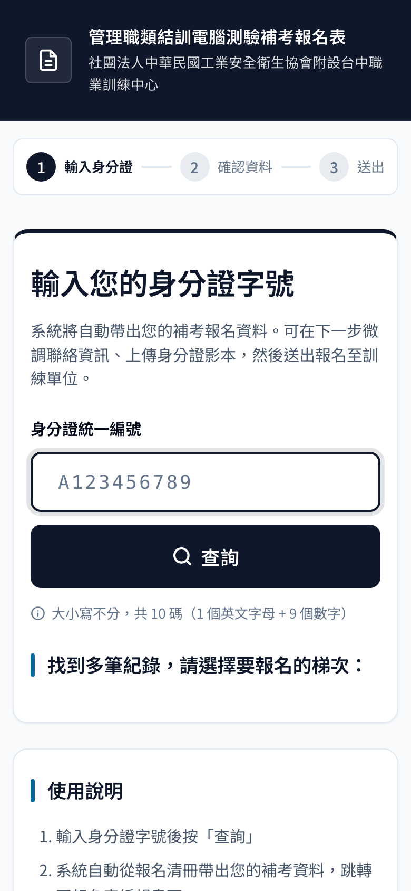
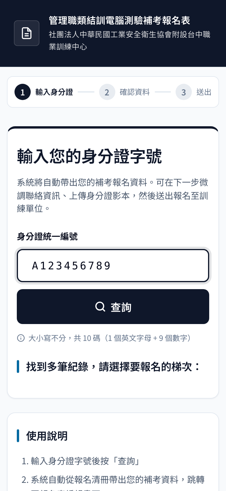
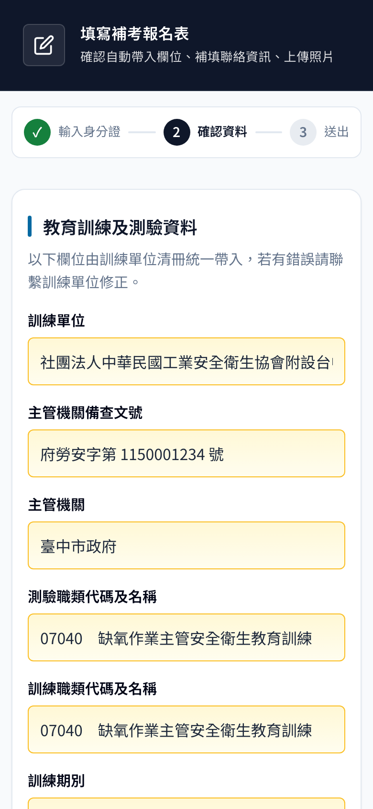
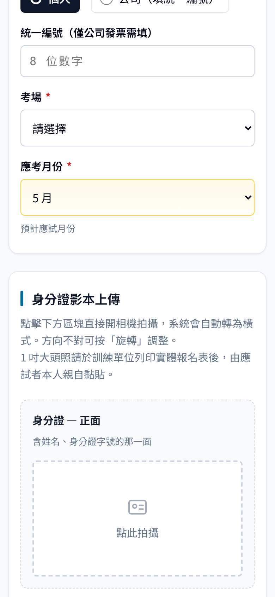
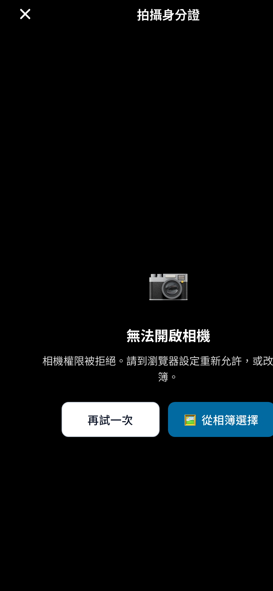
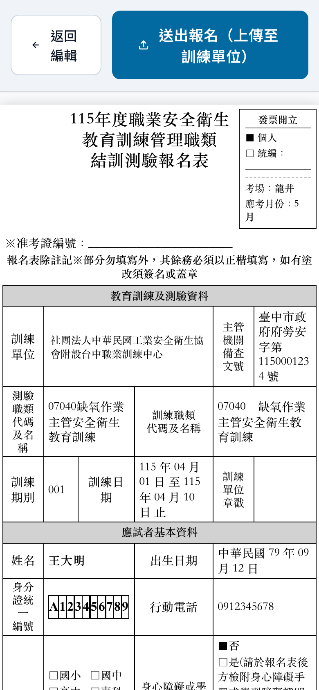
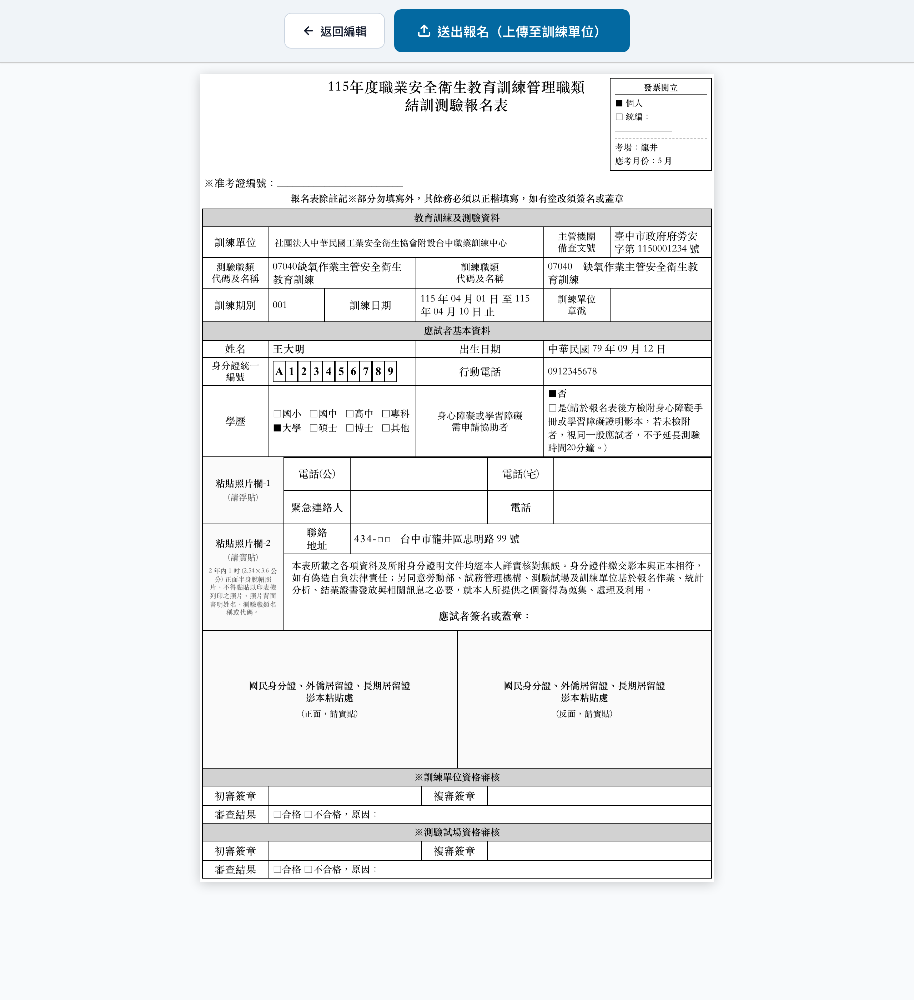

# 📝 管理職類測驗補考 — 線上報名操作說明

> 親愛的學員您好，本次補考改採**線上報名**，只需手機操作，約 **3 分鐘**即可完成。
> 本文圖文說明，請依以下步驟操作。

---

## 🌐 報名網址

打開手機瀏覽器，輸入以下網址（建議 iOS 用 **Safari**、Android 用 **Chrome**）：

```
https://isha-taichung.github.io/isha-retest-form/
```

> 💡 建議使用訓練單位傳送的 **QR code** 或 **LINE 連結**直接開啟，省去打字。

---

## 🪜 操作流程（3 步驟）

### Step 1 — 輸入身分證字號

打開報名網址後，畫面長這樣 👇



**操作方式：**

1. 點一下「**身分證統一編號**」下的白色欄位
2. 輸入您的身分證（**大小寫不分**，共 10 碼：1 個英文字母 + 9 個數字）
3. 按下藍底「**🔍 查詢**」按鈕



> ⚠️ **查不到資料？**
> - 確認字號是否打錯、字數是否為 10 碼
> - 若仍查無，表示您不在本次補考清冊內，請聯繫訓練單位確認

---

### Step 2 — 確認資料 & 拍身分證

查詢成功後自動跳轉到**報名表編輯畫面**。



**三區欄位說明：**

| 顏色 | 意義 | 您要做什麼 |
|---|---|---|
| 🟡 **黃底** | 訓練單位清冊已帶入 | **不用動**（若有錯請聯繫訓練單位） |
| ⬜ **白底** | 需要您確認或補填 | 檢查姓名、電話、地址是否正確 |
| 🔴 **紅色 `*`** | 必填欄位 | 一定要填才能送出 |

**必填欄位（紅色 `*`）：**

- 姓名
- 身分證統一編號
- 行動電話
- 聯絡地址
- **考場**（龍井／忠明 擇一）
- **應考月份**（系統已自動預填，可修改）

#### 📷 拍身分證正反面

向下滑到「**身分證影本上傳**」區塊：



**操作方式：**

1. 點「**點此拍攝**」的方框 → 跳出全螢幕相機畫面
2. 把身分證對準畫面中央青色的方框（系統會自動裁切到框內）
3. 按下底部白色圓形快門 → 進入裁切畫面 → 確認後完成
4. 分別拍身分證**正面**（有姓名、身分證字號那面）和**反面**（有父母配偶、戶籍地址那面）
5. 拍壞了？按「**清除重拍**」再拍一次；想微調框位 → 按「**✂ 重新裁切**」

> 💡 **1 吋大頭照不用上傳**，請在實體報名表列印後，由您本人親自黏貼。

---

##### ⚠️ Plan B：相機開不起來怎麼辦？

部分 Android 手機（特別是三星某些機型）即使在系統設定允許了相機權限，瀏覽器仍可能讀不到鏡頭，畫面會變成這樣：



**請依下列步驟改用相簿：**

1. **離開報名頁面**，打開手機原生「相機」App
2. **拍下身分證正反面**（建議橫拍，光線足夠不反光）
3. **回到報名頁面**，再點一次「點此拍攝」
4. 看到「無法開啟相機」畫面 → 點 **「🖼️ 從相簿選擇」** 按鈕
5. 從相簿挑剛剛拍好的身分證照片即可，後續裁切流程相同

#### ✅ 填完按「下一步」

頁面最下方有兩顆按鈕：

- `← 返回查詢`：回到首頁重查
- `下一步（確認資料）→`：進入確認畫面

---

### Step 3 — 確認 & 送出

最後會看到完整的 **A4 報名表預覽**，如下圖：



**確認無誤後：**

1. 畫面最上方有兩顆按鈕
   - `← 返回編輯`：想改資料就按這個
   - `📤 送出報名（上傳至訓練單位）`：確認送出
2. 按下送出按鈕後
   - 系統會顯示「**⏳ 正在產生 PDF**，約 3-5 秒」
   - 接著「**⏳ 上傳至訓練單位**」
3. 看到「**✅ 送出成功**」就完成了！
4. **3 秒後**自動跳轉到訓練單位**官方 LINE 加好友頁面** — 請務必加好友，之後考試通知都靠 LINE 傳達



*（這是送到訓練單位的最終報名表樣貌，訓練單位列印後會交給您親簽＋貼大頭照）*

---

## ❓ 常見問題 FAQ

### Q1：輸入身分證字號後，系統說「查無此身分證資料」

**A：** 三個可能原因：

1. **打錯字** — 仔細核對字號（特別是 `O` 與 `0`、`I` 與 `1`）
2. **不在清冊** — 您還沒被登記到本次補考名單，請洽訓練單位
3. **剛被加入、系統尚未同步** — 等 30 分鐘後再試

---

### Q2：手機拍的身分證是直的，有問題嗎？

**A：** 沒問題！相機畫面內的青色框會引導您橫式構圖，拍出來的方向都會自動處理。若拍出來不滿意 → 按「**✂ 重新裁切**」微調，或按「**清除重拍**」整張重拍。

---

### Q3：送出後可以重填嗎？

**A：** 技術上可以（回首頁重查、重填、再送），但**請避免重複送出**，以免訓練單位收到多份報名表造成作業困擾。如果是資料填錯，建議直接聯繫訓練單位協助修正。

---

### Q4：網頁打不開 / 一直轉圈圈？

**A：**

- 確認**手機網路正常**（可先打開別的網站測試）
- 關閉瀏覽器**所有分頁**重新打開
- 試試**無痕模式**（iOS Safari 或 Android Chrome 都支援）
- 實在不行，換一支手機 / 電腦試試

---

### Q5：我的手機相機拍照後上傳失敗？

**A：** 通常是照片檔案太大。系統會自動壓縮，但若太多次失敗：

- 相機**切到「低畫質」或「小尺寸」**再拍一次
- 或用**截圖**（把身分證擺整齊後拍下螢幕）

---

### Q6：我沒看到 LINE 加好友的跳轉？

**A：**

- 檢查是否有**彈出視窗被瀏覽器擋住**
- 送出成功畫面會顯示訓練單位的 LINE ID / QR code，**手動加入**也一樣
- 或聯繫訓練單位索取 LINE 官方帳號

---

### Q7：送出時看到「送出過於頻繁」？

**A：** 系統每分鐘限送 10 次防濫用。**等 1 分鐘後重試**即可。

---

### Q8：必填欄位打勾了為什麼還顯示紅框？

**A：** 可能：

- 欄位前後有**多餘空白** — 刪掉重打
- 統一編號必須是 **8 位純數字**（只有選「公司發票」才需要填）

---

## 📞 聯絡方式

若有任何問題，請聯繫訓練單位：

- **單位**：社團法人中華民國工業安全衛生協會附設台中職業訓練中心
- **電話**：（請向訓練單位確認最新聯絡電話）
- **LINE 官方帳號**：送出報名成功後自動跳轉加入

---

## 📋 操作重點快速回顧

1. 打開 **https://isha-taichung.github.io/isha-retest-form/**
2. 輸入**身分證 10 碼** → 查詢
3. 確認**黃底**欄位正確、補填**白底**欄位、拍**身分證正反面**
4. 按**下一步** → 預覽 → 按**送出報名**
5. 看到 **✅ 送出成功** → 加入訓練單位 LINE → 完成！

> 💪 您已成功完成線上報名！後續考試時間、地點，請留意 LINE 通知。

---

*本說明文件版本：v20260420c*
*若系統有更新，以最新畫面為準，但大致流程不變。*
